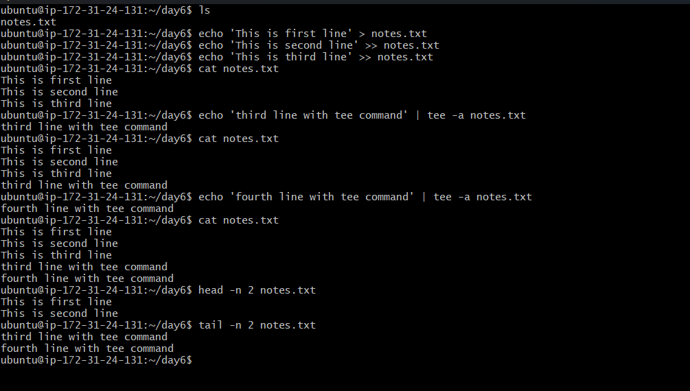

ubuntu@ip-172-31-24-131:~/day6$ ls
notes.txt
ubuntu@ip-172-31-24-131:~/day6$ echo 'This is first line' > notes.txt
ubuntu@ip-172-31-24-131:~/day6$ echo 'This is second line' >> notes.txt
ubuntu@ip-172-31-24-131:~/day6$ echo 'This is third line' >> notes.txt
ubuntu@ip-172-31-24-131:~/day6$ cat notes.txt
This is first line
This is second line
This is third line
ubuntu@ip-172-31-24-131:~/day6$ echo 'third line with tee command' | tee -a notes.txt
third line with tee command
ubuntu@ip-172-31-24-131:~/day6$ cat notes.txt
This is first line
This is second line
This is third line
third line with tee command
ubuntu@ip-172-31-24-131:~/day6$ echo 'fourth line with tee command' | tee -a notes.txt
fourth line with tee command
ubuntu@ip-172-31-24-131:~/day6$ cat notes.txt
This is first line
This is second line
This is third line
third line with tee command
fourth line with tee command
ubuntu@ip-172-31-24-131:~/day6$ head -n 2 notes.txt
This is first line
This is second line
ubuntu@ip-172-31-24-131:~/day6$ tail -n 2 notes.txt
third line with tee command
fourth line with tee command
ubuntu@ip-172-31-24-131:~/day6$ Read from remote host 3.84.137.24: Connection reset by peer
Connection to 3.84.137.24 closed.
client_loop: send disconnect: Connection reset by peer
