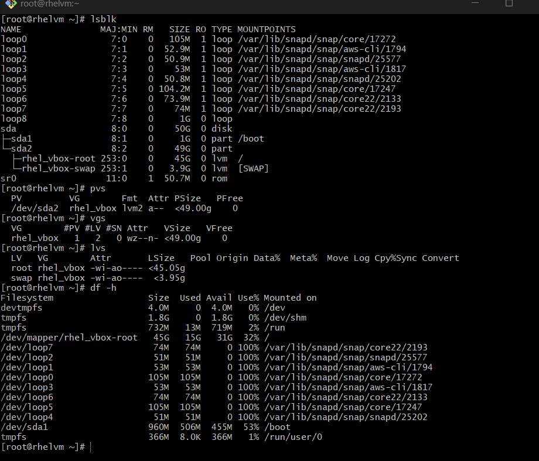
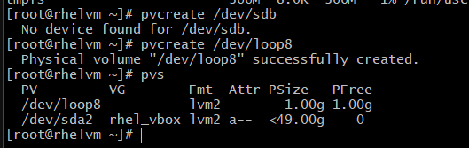
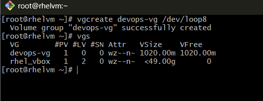
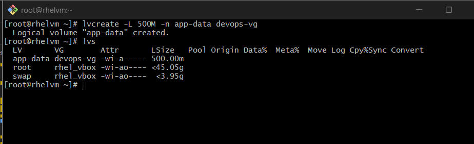
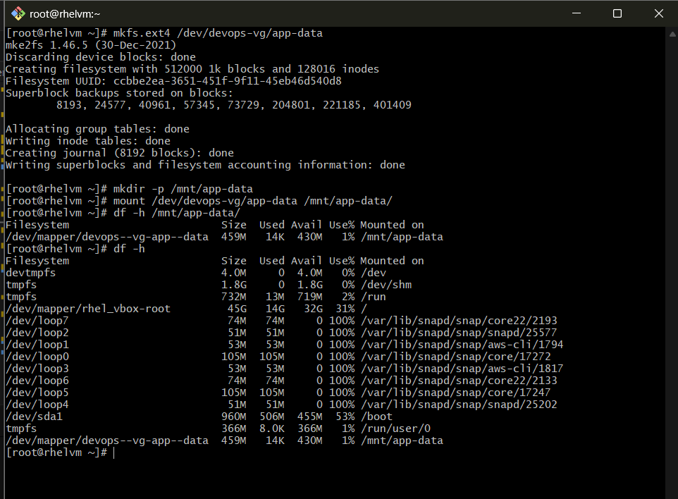
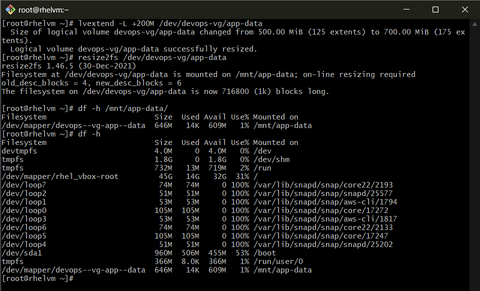

# Day 13

### Task 1: Check Current Storage

### Task 2: Create Physical Volume

### Task 3: Create Volume Group

### Task 4: Create Logical Volume

### Task 5: Format and Mount

### Task 6: Extend the Volume

## What I Learned

- I learned that LVM works on top of physical volumes, allowing for flexible storage management. It works as layers, Disk/file system -> Logical Volume -> Volume Group -> Physical Volume. Also, I learned that LVM allows for dynamic resizing of volumes, which is useful for managing storage needs without downtime. Lastly, I learned that LVM provides features like snapshots and striping, which can enhance performance and data management.

- I learned that logical volume resize is a two step process. First, you extend the logical volume using `lvextend`, and then you need to resize the filesystem with `resize2fs` to make use of the new space.

- I learned that if the physical volume is a loop device, you can create it using `pvcreate` and then manage it with LVM commands just like any other physical volume. This allows for testing and learning LVM without needing additional hardware.