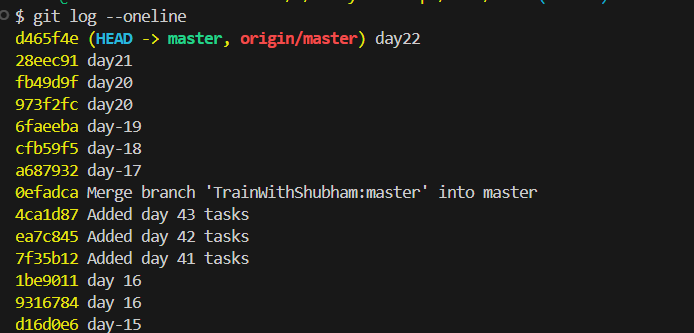

# Day 22 task

# Task 1:
1. Verify Git is installed on your machine: git --version
2. Set up your Git identity — name and email:
   - git config --global user.name "Your Name"
   - git config --global user.email "your.email@example.com"
3. Verify your configuration: git config --list

# Task 2:

1. Create a new Git repository: mkdir devops-git-practice && cd devops-git-practice
2. Initialize it as a Git repository: git init
3. Check the status: git status
4. Explore the hidden .git/ directory: ls -a .git/

# Task 3:
1. Create a file called git-commands.md: touch git-commands.md

**Setup & Config**
git config --global user.name "Name": Sets the name for your commits.
git config --list: Shows all current Git configuration settings.

**Basic Workflow**
git init: Initializes a new Git repository in the current folder.
git status: Shows the state of the working directory and staging area.
git add <file>: Adds a file to the staging area, preparing it for a commit.
git commit -m "message": Saves the staged snapshot to the project history.

**Viewing Changes**
git log: Shows a list of all commits made in the repository.
git diff: Shows the differences between the working directory and the last commit.

# Task 4:
1. Stage your file: git add git-commands.md
2. Check what's staged: git status
3. Commit with a meaningful message: git commit -m "Add initial Git commands reference"
4. View your commit history: git log

# Task 5:
1. Edit git-commands.md — add more commands as you discover them
2. Check what changed since your last commit: git status
3. Stage and commit again with a different, descriptive message: git add git-commands.md && git commit -m "Add more Git commands to reference"
4. Repeat this process at least 3 times so you have multiple commits in your history
5. view the full history in a compact format: git log --oneline

# Task 6:
1. What is the difference between git add and git commit?
   - git add stages changes, while git commit saves those staged changes to the repository history.
   - git add prepares changes for commit, while git commit finalizes and records those changes in the project history.

2. What does the staging area do? Why doesn't Git just commit directly?
    - The staging area allows you to review and organize changes before committing. It gives you control over what goes into a commit, enabling you to create meaningful commits that group related changes together. Git doesn't commit directly to allow for this level of control and organization.

3. What information does git log show you?
   - git log shows you a history of commits in the repository, including the commit hash, author, date, and commit message.

4. What is the .git/ folder and what happens if you delete it?
   - The .git/ folder is where Git stores all the information about the repository, including commit history, branches, and configuration. If you delete it, you will lose all version control information, and the folder will no longer be a Git repository.

5. What is the difference between a working directory, staging area, and repository?
   - The working directory is where you make changes to your files. The staging area is where you prepare changes for commit. The repository is where Git stores the history of commits and all version control information.

