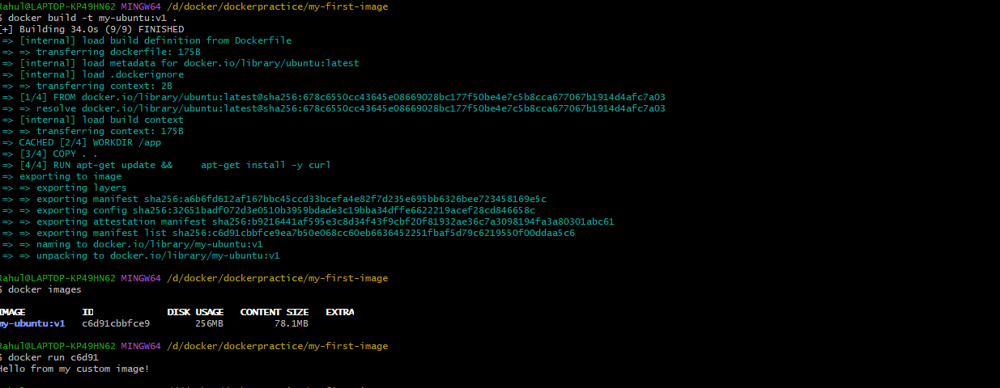
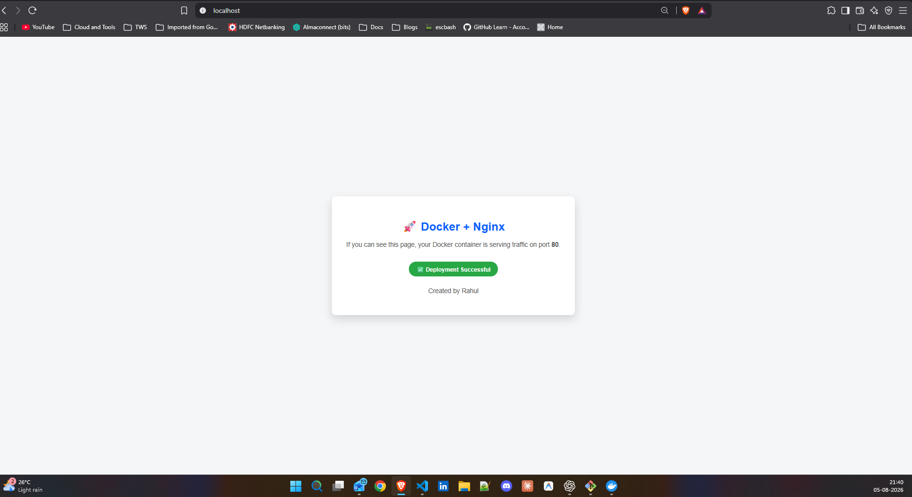
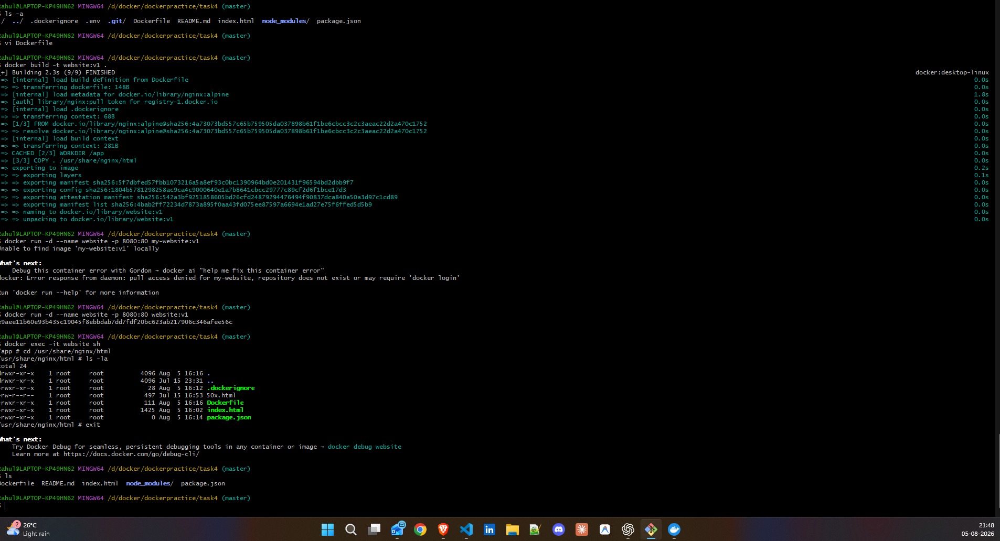

### Task 1: Your First Dockerfile

### Task 2: Dockerfile Instructions
`
FROM nginx:alpine
WORKDIR /app
RUN mkdir logs && \
    echo "Docker build completed successfully!" > logs/build-info.txt
COPY index.html /usr/share/nginx/html/
EXPOSE 80
CMD ["nginx", "-g", "daemon off;"]
`
### Task 3: CMD vs ENTRYPOINT
cmd is used to set default commands that can be overridden when running the container, while entrypoint is used to set a command that will always run, and any additional arguments will be passed to it.

### Task 4: Build a Simple Web App Image

### Task 5: .dockerignore

### Task 6: Build Optimization
layer matters for build speed because Docker caches each layer, so if you change a line that is early in the Dockerfile, it will invalidate the cache for all subsequent layers, leading to longer build times. By placing frequently changing lines towards the end of the Dockerfile, you can take advantage of caching and speed up the build process.