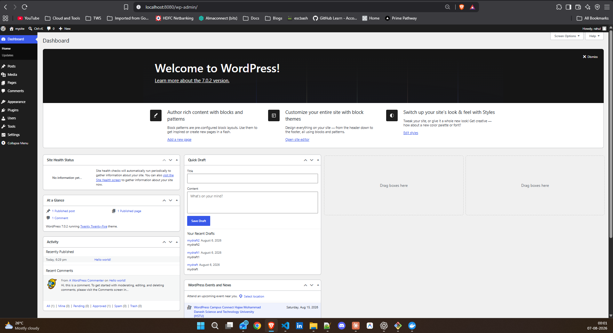

# Docker Compose Guide

## Task 2: Your First Compose File

```yaml
services:
  web:
    image: nginx:latest
    ports:
      - "8080:80"
    volumes:
      - ./html:/usr/share/nginx/html
```

## Task 3: Two-Container Setup



## Task 4: Compose Commands

1. start services in **detached mode**: `docker compose up -d`
2. view running services: `docker compose ps`
3. view **logs** of all services: `docker compose logs -f`
4. view logs of a **specific** service: `docker compose logs -f <service_name>`
5. **stop** services without removing: `docker compose stop`
6. **remove** everything (containers, networks): `docker compose down`
7. **rebuild** images if you make a change: `docker compose up --build`

## Task 5: Environment Variables

the `.env` file should look like this:

```env
MYSQL_ROOT_PASSWORD=root
MYSQL_DATABASE=wordpress
MYSQL_USER=wpuser
MYSQL_PASSWORD=wppass

WORDPRESS_DB_HOST=db:3306
WORDPRESS_DB_USER=wpuser
WORDPRESS_DB_PASSWORD=wppass
WORDPRESS_DB_NAME=wordpress
```

and the `docker-compose.yml` file should look like this:

```yaml
services:
  db:
    image: mysql:8.0
    restart: always
    environment:
      MYSQL_ROOT_PASSWORD: ${MYSQL_ROOT_PASSWORD}
      MYSQL_DATABASE: ${MYSQL_DATABASE}
      MYSQL_USER: ${MYSQL_USER}
      MYSQL_PASSWORD: ${MYSQL_PASSWORD}
    volumes:
      - compose:/var/lib/mysql

  wordpress:
    image: wordpress
    restart: always
    ports:
      - "8080:80"
    environment:
      WORDPRESS_DB_HOST: ${WORDPRESS_DB_HOST}
      WORDPRESS_DB_USER: ${WORDPRESS_DB_USER}
      WORDPRESS_DB_PASSWORD: ${WORDPRESS_DB_PASSWORD}
      WORDPRESS_DB_NAME: ${WORDPRESS_DB_NAME}
    depends_on:
      - db
volumes:
  compose:
