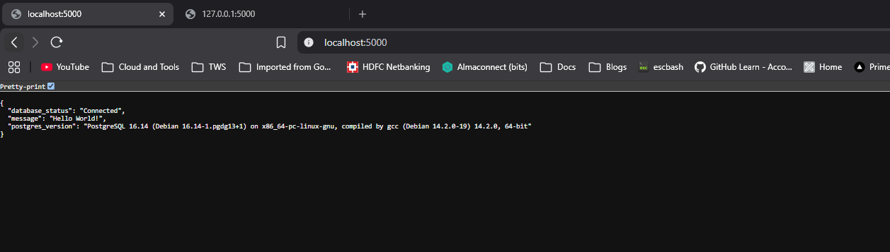
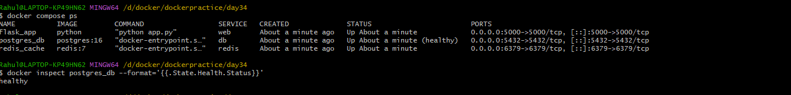
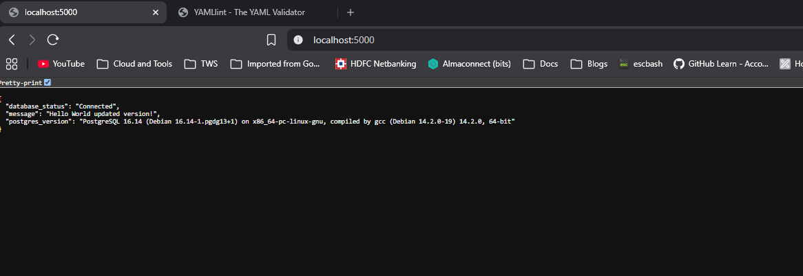
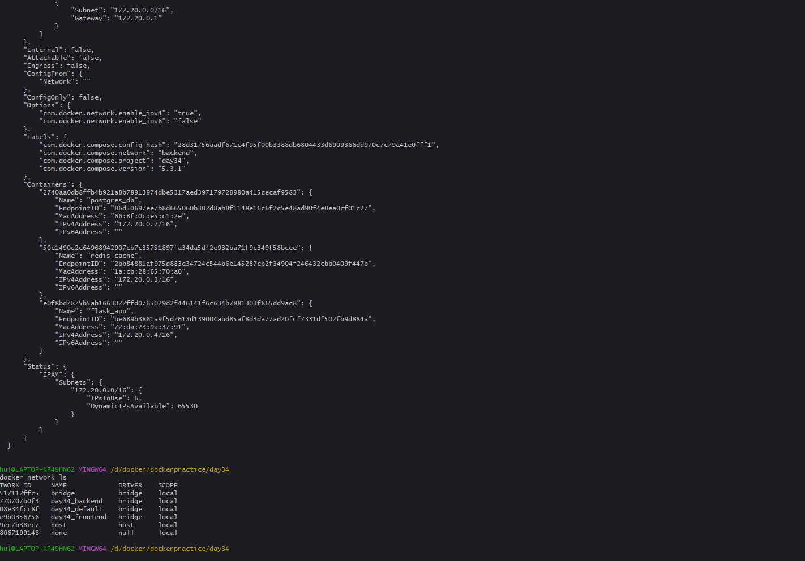
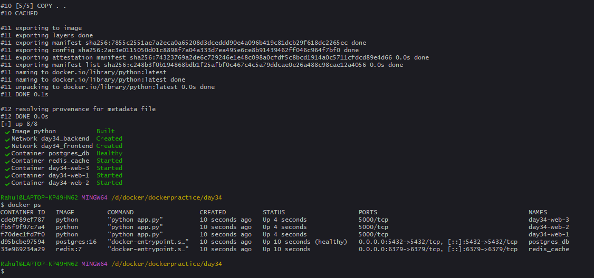
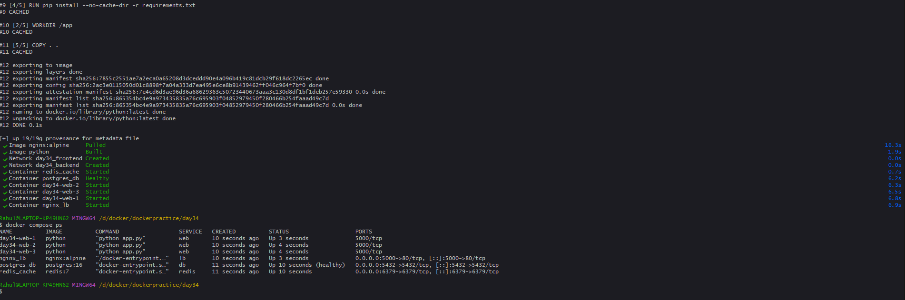

### Task 1: Build Your Own App Stack

### Task 2: depends_on & Healthchecks

### Task 3: Restart Policies
restart policies are a way to control how Docker handles container failures. The `restart: always` policy ensures that the container will always restart if it stops, regardless of the exit status. This is useful for critical services that need to be running at all times.On the other hand, `restart: on-failure` will only restart the container if it exits with a non-zero status, which is useful for services that may fail due to temporary issues but don't need to be running continuously.

### Task 4: Custom Dockerfiles in Compose

### Task 5: Named Networks & Volumes

### Task 6: Scaling (Bonus)

Simple scaling does not work with fixed host port mapping because multiple containers cannot bind to the same host port at the same time. For example, if the `web` service maps `5000:5000` and we scale it to three replicas, all three containers would try to use host port `5000`, causing a port conflict. Instead, each replica should expose the application port internally on the Docker network, while a load balancer such as Nginx publishes a single host port and distributes incoming traffic across the multiple replicas.
