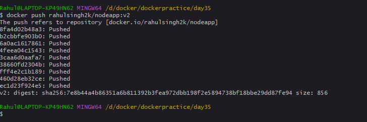
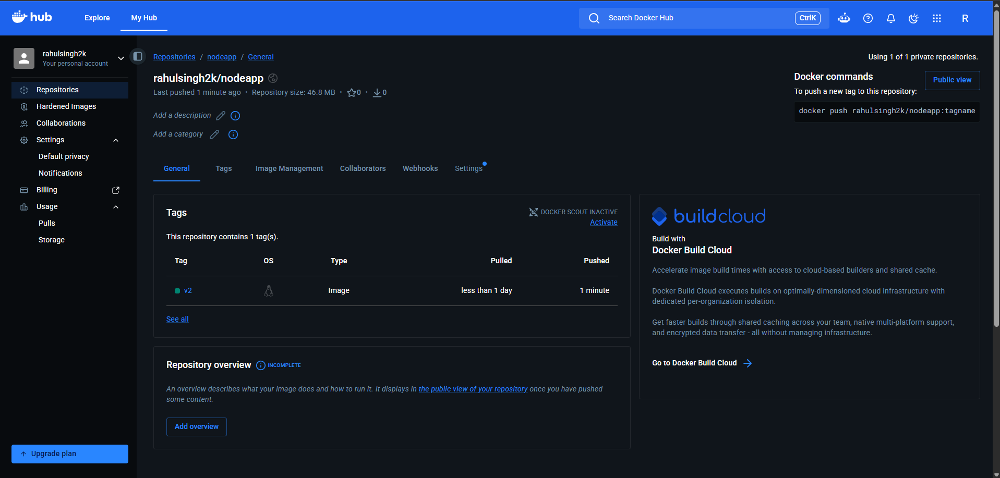
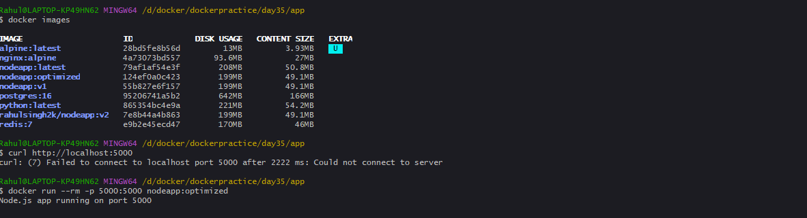

### Task 1: The Problem with Large Images
previous size: nodeapp:latest   79af1af54e3f        208MB         50.8MB

### Task 2: Multi-Stage Build
current size: nodeapp:v1       55b827e6f157        199MB         49.1MB

### Task 3: Push to Docker Hub


### Task 4: Docker Hub Repository


### Task 5: Image Best Practices


Dockerfile for Task 5:
```FROM node:20-alpine AS builder
WORKDIR /app
COPY package*.json ./
RUN npm ci --omit=dev
COPY app.js ./

FROM node:20-alpine
WORKDIR /app
COPY --from=builder --chown=node:node /app/package*.json ./
COPY --from=builder --chown=node:node /app/node_modules ./node_modules
COPY --from=builder --chown=node:node /app/app.js ./
USER node
EXPOSE 5000
CMD ["node", "app.js"]
```