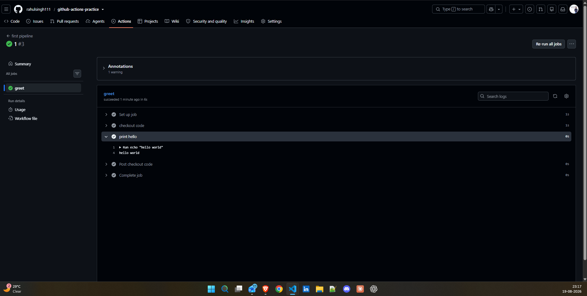

screenshot of the GitHub Actions workflow interface


### Task 3: Understand the Anatomy
on: Specifies the events that trigger the workflow, such as pushes or pull requests.
jobs: Defines the jobs that will run as part of the workflow. Each job can have its own set of steps and runs independently.
runs-on: Specifies the type of virtual machine to run the job on, such as ubuntu-latest or windows-latest.
steps: Lists the individual steps that make up a job. Each step can run commands or use actions.
uses: Specifies an action to use in a step. Actions are reusable units of code that can perform specific tasks.
run: Executes shell commands in a step. This is where you can run scripts or commands directly.
name: Provides a human-readable name for a step, making it easier to identify in the workflow logs.


### Task 4: Add More Steps
```
name: first pipeline

on:
  push:
    branches:
      - main

jobs:
  greet:
    runs-on: ubuntu-latest

    steps:
      - name: checkout code
        uses: actions/checkout@v4

      - name: print hello
        run: echo "hello world"

      - name: print current date and time
        run: 'echo "Current Date/Time: $(date +''%Y-%m-%dT%H:%M:%S'')"'

      - name: print branch name
        run: 'echo "Branch: ${{ github.ref_name }}"'

      - name: list files
        run: 'ls -la'

      - name: print operating system
        run: 'echo "Operating System: $RUNNER_OS"'

  show_date:
    runs-on: ubuntu-latest

    steps:
      - name: show date
        run: 'echo "Current Date/Time: $(date +''%Y-%m-%d %H:%M:%S'')"'
```

### Task 5: Break It On Purpose
after breaking the pipeline, the workflow will show a red X indicating failure. Clicking into the job will show which step failed, along with the error message. The logs will provide details about what went wrong, allowing you to identify and fix the issue before pushing again.