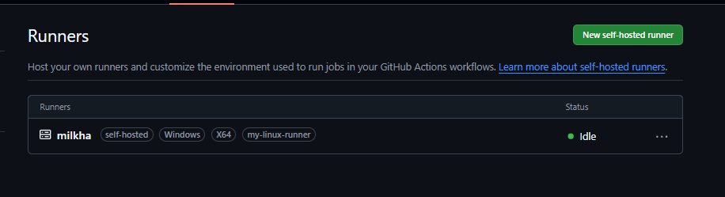

### Task 1: GitHub-Hosted Runners
```
name: os-checks
on:
    push:
        branches:
            - main
    workflow_dispatch:
jobs:
    ubuntu:
        runs-on: ubuntu-latest
        steps:
            - name: this shows ubuntu os
              run: |
                echo "OS Name: ${{ runner.os }}"
                echo "Runner hostname: $(hostname)"
                echo "current User: $(whoami)"
            - name: shows software versions
              run: |
                echo "docker"
                docker --version

                echo "python"
                python --version

                echo "node"
                node --version

                echo "git"
                git --version
    windows:
        runs-on: windows-latest
        steps:
            - name: this shows windows os
              run: |
                echo "OS Name: ${{ runner.os }}"
                echo "Runner hostname: $(hostname)"
                echo "current User: $(whoami)"
    macos:
        runs-on: macos-latest
        steps:
            - name: this shows mac os
              run: |
                echo "OS Name: ${{ runner.os }}"
                echo "Runner hostname: $(hostname)"
                echo "current User: $(whoami)"
```
github hosted runners are virtual machines that GitHub provides to run your workflows. They are managed by GitHub, which means they handle the maintenance, updates, and security of these runners. Users do not need to worry about the underlying infrastructure, as GitHub ensures that the runners are available and up-to-date with the necessary software and tools pre-installed.

### Task 2: Explore What's Pre-installed
it matters that runners come with tools pre-installed because it saves time and effort for developers. They can immediately start using the necessary tools without having to install them manually, which speeds up the development and testing process. Additionally, having a consistent environment across different runs helps in reducing discrepancies and potential issues that may arise from different software versions or configurations.

### Task 3: Set Up a Self-Hosted Runner


### Task 4: Use Your Self-Hosted Runner
```
   self-hosted:
        runs-on: [self-hosted, my-linux-runner]
        steps:
            - name: check code
              uses: actions/checkout@v5
            - name: print hostname
              run: hostname

            - name: print working directory
              run: pwd

            - name: create test file
              run: |
                echo "Created by GitHub Actions" > github-actions-test.txt

            - name: verify file exists
              run: |
                Get-Item github-actions-test.txt
                Test-Path "github-actions-test.txt"

            - name: show machine info
              run: |
                echo "Running on:"
                hostname
                echo "Working directory:"
                pwd
```

### Task 5: Labels
labels are used to categorize and identify self-hosted runners based on their characteristics or capabilities. By adding a label to your self-hosted runner, you can specify which workflows should run on that particular runner. This allows for better organization and management of runners, especially when you have multiple self-hosted runners with different configurations or purposes.

### Task 6: GitHub-Hosted vs Self-Hosted
| | GitHub-Hosted | Self-Hosted |
|---|---|---|
| Who manages it? | GitHub | You |
| Cost | Free (limited) | Depends on infrastructure |
| Pre-installed tools | Yes | Depends on setup |
| Good for | Simple workflows | Complex or custom workflows |
| Security concern | Lower | Higher (you control the environment) |