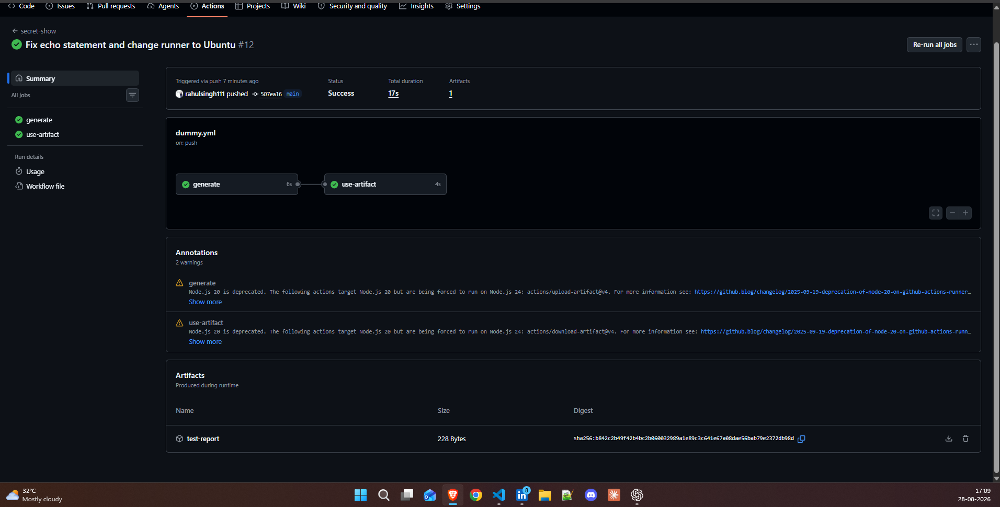
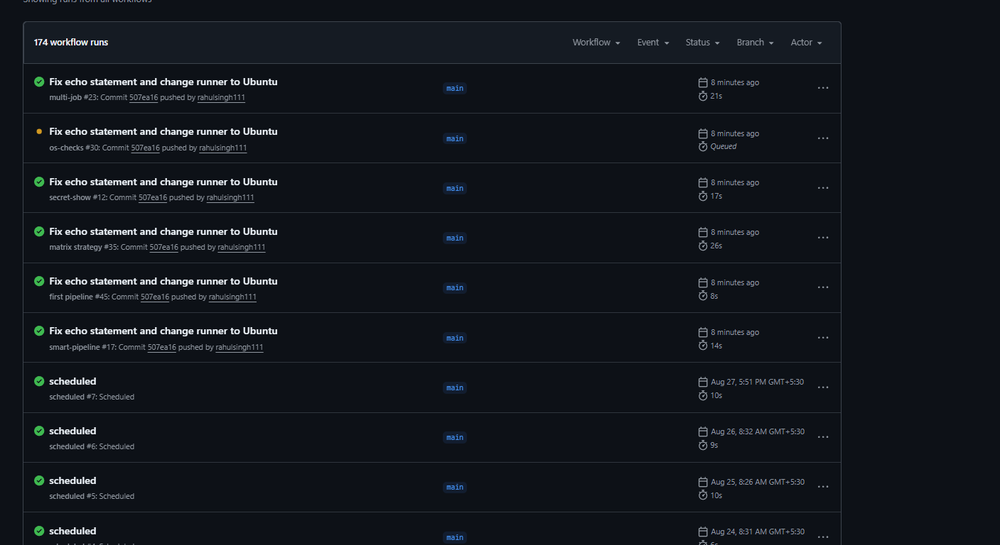

screenshot of the artifact:

Screenshot of your passing test run

What you learned about secrets management
secrets are a way to store sensitive information, such as API keys or passwords, in a secure manner. They can be accessed in workflows using the `${{ secrets.SECRET_NAME }}` syntax. GitHub automatically masks secret values in logs to prevent accidental exposure. It's important to manage secrets carefully and avoid hardcoding them in your codebase.