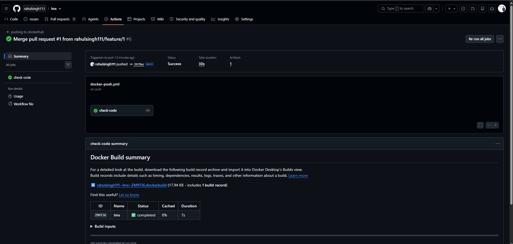
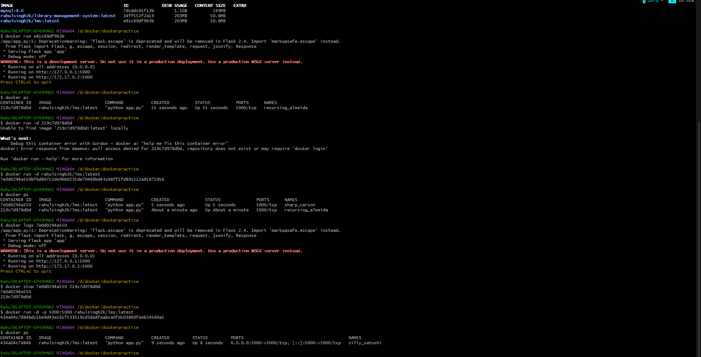

my complete workflow looks like this:

```name: pushing to dockerhub
#checking feat
on:
    push:
        branches:
            - main
jobs:
    check-code:
        runs-on: ubuntu-latest
        steps:
            - name: check code
              uses: actions/checkout@v7

            - name: login to dockerhub
              uses: docker/login-action@v4
              with:
                username: ${{ vars.DOCKERHUB_USERNAME }}
                password: ${{ secrets.DOCKERHUB_TOKEN }}

            - name: build and push
              uses: docker/build-push-action@v7
              with:
                context: .
                push: true
                tags: ${{ vars.DOCKERHUB_USERNAME }}/lms:latest
```

### Task 3: Push to Docker Hub
docker pull rahulsingh2k/lms

### Task 5: Add a Status Badge


### Task 6: Pull and Run It



the journey from `git push` to a running container is tremendous as I stepped into a new world of automation and continuous integration. It all starts with a simple `git push` command, which triggers the GitHub Actions workflow defined in the `.github/workflows/docker-publish.yml` file and eventually leads to a running container. The workflow checks out the code, logs into Docker Hub using the provided secrets, builds the Docker image, and pushes it to Docker Hub. Once the image is pushed, I can pull it on my local machine or any cloud server and run it as a container. This entire process showcases the power of CI/CD pipelines in automating the deployment of applications.