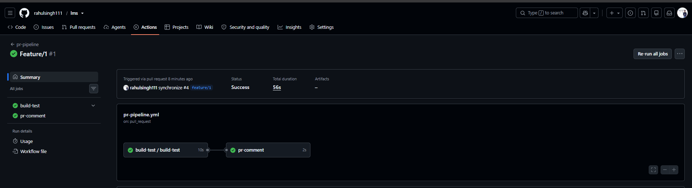
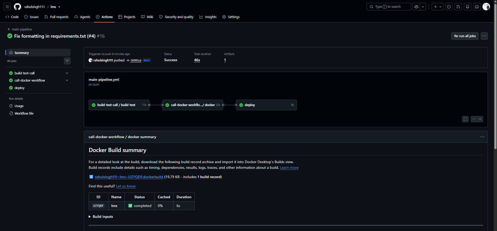

all yaml files
reusable-docker.yml
```
name: reusabledocker
on:
    workflow_call:
      inputs:
        image_name:
            type: string
            
        tag:
            required: true
            type: string

            
      secrets:
        DOCKERHUB_USERNAME:
            required: true
        DOCKERHUB_TOKEN:
            required: true

      outputs:
        image_url:
            value: ${{ jobs.docker.outputs.image_url }}
jobs:
    docker:
        runs-on: ubuntu-latest

        outputs:
            image_url: ${{ steps.image.outputs.image_url }}

        steps:
            - name: checkout code
              uses: actions/checkout@v4

            - name: login to dockerhub
              uses: docker/login-action@v4
              with:
                username: ${{ vars.DOCKERHUB_USERNAME }}
                password: ${{ secrets.DOCKERHUB_TOKEN }}

            - name: build and push
              uses: docker/build-push-action@v7
              with:
                context: .
                push: true
                tags: |
                    ${{ vars.DOCKERHUB_USERNAME }}/myapp:latest
                    ${{ vars.DOCKERHUB_USERNAME }}/myapp:${{ github.sha }}

            - name: Set image URL
              id: image
              run: echo "image_url=${{ inputs.image_name }}:${{ inputs.tag }}" >> "$GITHUB_OUTPUT"
```

reusable-build-test.yml
```
name: Reusable Build Test
on:
  workflow_call:
    inputs:
      python_version:
        required: false
        type: string
        default: "3.11"

      run_tests:
        required: false
        type: boolean
        default: true

    outputs:
      test_result:
        value: ${{ jobs.build-test.outputs.test_result }}

jobs:
    build-test:
        runs-on: ubuntu-latest

        outputs:
            test_result: ${{ steps.result.outputs.test_result }}

        steps:
            - name: checkoutcode
              uses: actions/checkout@v4
            
            - name: setup the language runtime
              uses: actions/setup-python@v7
              with:
                python-version: ${{ inputs.python_version }}
              
            - name: install dependencies
              run: |
                pip install -r requirements.txt
                python -m pip install --upgrade pip


            - name: Run tests
              id: tests
              if: ${{ inputs.run_tests }}
              continue-on-error: true
              run: |
                chmod +x tests/health_check.sh
                ./tests/health_check.sh

            - name: Set test result
              id: result
              if: always()
              run: |
                if [ "${{ inputs.run_tests }}" = "false" ]; then
                    echo "test_result=passed" >> "$GITHUB_OUTPUT"
                elif [ "${{ steps.tests.outcome }}" = "success" ]; then
                    echo "test_result=passed" >> "$GITHUB_OUTPUT"
                else
                    echo "test_result=failed" >> "$GITHUB_OUTPUT"
                fi
```
pr-pipeline.yml
```

name: pr-pipeline
on:
    pull_request:
        branches:
            - main
        types: [opened, synchronize]
jobs:
    build-test:
        uses: ./.github/workflows/reusable-build-test.yml
        with:
            run_tests: true

    pr-comment:
        needs: build-test
        runs-on: ubuntu-latest

        steps:
            - name: print pr summary
              run: |
                echo "PR checks passed for branch: ${{ github.head_ref }}"
```

main-pipeline.yml
```
name: main-pipeline
on:
    push:
        branches:
            - main
jobs:
    build-test-call:
        uses: ./.github/workflows/reusable-build-test.yml
        with:
            run_tests: true

    call-docker-workflow:
        needs: build-test-call
        uses: ./.github/workflows/reusable-docker.yml
        with:
            image_name: rahulsingh2k/lms
            tag: latest
        secrets:
            DOCKERHUB_USERNAME: ${{ vars.DOCKERHUB_USERNAME }}
            DOCKERHUB_TOKEN: ${{ secrets.DOCKERHUB_TOKEN }}

    deploy:
        needs: call-docker-workflow
        runs-on: ubuntu-latest
        environment: production
        steps:
            - name: deploying
              run: 'echo Deploying image: ${{ needs.call-docker-workflow.outputs.image-tag }} to production'
```

health-check.yml
```
name: healthcheck
on:
  schedule:
    - cron: '0 */12 * * *'
  workflow_dispatch:

jobs:
    pulling-image:
        runs-on: ubuntu-latest
        steps:
            - name: Login to DockerHub
              uses: docker/login-action@v3
              with:
                username: ${{ vars.DOCKERHUB_USERNAME }}
                password: ${{ secrets.DOCKERHUB_TOKEN }}

            - name: Pull latest Docker image
              run: docker pull rahulsingh2k/lms:latest

            - name: Run the container in detached mode
              run: docker run --name lms -d -p 5000:5000 rahulsingh2k/lms:latest

            - name: Wait 5 seconds, then curl the health endpoint
              run: |
                sleep 5
                if curl -f http://localhost:8080/health; then
                    echo "PASS: Health check successful"
                else
                    echo "FAIL: Health check failed"
                fi

            - name: Stop and remove container
              if: always()
              run: |
                docker stop lms || true
                docker rm lms || true

            - name: Create health check summary
              if: always()
              run: |
                    echo "## Health Check Report" >> $GITHUB_STEP_SUMMARY
                    echo "- Image: myapp:latest" >> $GITHUB_STEP_SUMMARY
                    echo "- Status: PASSED" >> $GITHUB_STEP_SUMMARY
                    echo "- Time: $(date)" >> $GITHUB_STEP_SUMMARY
```

docker-push.yml
```
name: pushing to dockerhub
#checking feat
on:
    push:
        branches:
            - main
jobs:
    check-code:
        runs-on: ubuntu-latest
        steps:
            - name: check code
              uses: actions/checkout@v7

            - name: login to dockerhub
              uses: docker/login-action@v4
              with:
                username: ${{ vars.DOCKERHUB_USERNAME }}
                password: ${{ secrets.DOCKERHUB_TOKEN }}

            - name: build and push
              uses: docker/build-push-action@v7
              with:
                context: .
                push: true
                tags: | 
                    ${{ vars.DOCKERHUB_USERNAME }}/lms:latest
                    ${{ vars.DOCKERHUB_USERNAME }}/lms:sha-${{ github.sha }}

            - name: Run Trivy vulnerability scanner
              uses: aquasecurity/trivy-action@master
              with:
                image-ref: '${{ vars.DOCKERHUB_USERNAME }}/lms:sha-${{ github.sha }}'
                format: 'table'
                exit-code: '1'
                severity: 'CRITICAL,HIGH'

            - name: Upload Trivy scan report
              if: always()
              uses: actions/upload-artifact@v4
              with:
                name: trivy-scan-report
                path: trivy-report.txt
```

screenshot of pr pipeline


Screenshot of a main branch push running the full pipeline


Docker Hub link to your pushed image
https://hub.docker.com/repository/docker/rahulsingh2k/lms/general

What you'd improve next
I would improve the pipeline by adding Slack notifications for build and deployment status, implementing multi-environment deployments (staging and production), and adding a rollback mechanism in case of failed deployments. Additionally, I would enhance security by integrating more comprehensive vulnerability scanning and compliance checks.