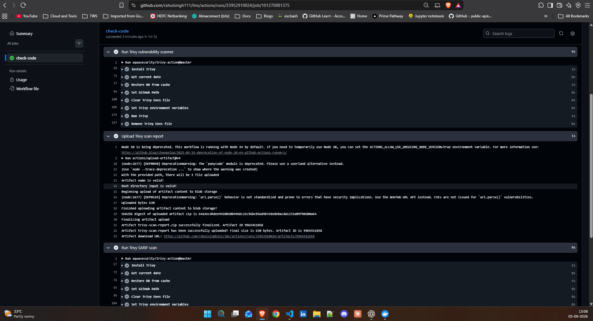

devsecops means integrating security practices into the DevOps process. It emphasizes that security should be a shared responsibility throughout the entire software development lifecycle, rather than being an afterthought. By incorporating automated security checks and scans into the CI/CD pipeline, teams can identify and address vulnerabilities early, ensuring that applications are secure by design. We don't want to wait until after deployment to find security issues; instead, we want to catch them during development and testing phases.

Screenshot of Trivy scan output in your pipeline

Your updated pipeline diagram with security steps
Already updated in the previous day-48 submission. No changes needed.

What you learned about secret scanning and dependency review
Secret scanning is a feature provided by GitHub that automatically detects sensitive information, such as API keys and passwords, in your codebase. When enabled, it scans the repository for any secrets that may have been accidentally committed and alerts you to their presence. This helps prevent potential security breaches by ensuring that sensitive data is not exposed in the code.

Dependency review is a feature that checks the dependencies of your project for known vulnerabilities. It helps ensure that you are not using packages that have security issues, which could potentially be exploited by attackers.