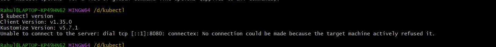

### Task 1: Recall the Kubernetes Story

kubernetes was created to address the challenges of managing containerized applications at scale. While Docker provides a way to package and run containers, it does not offer the orchestration capabilities needed for deploying, scaling, and managing containers across multiple hosts. Kubernetes solves this problem by providing a platform for automating deployment, scaling, and operations of application containers across clusters of hosts.
kubernetes was originally developed by Google, inspired by their internal system called Borg, which managed their large-scale containerized applications. The name "Kubernetes" comes from the Greek word for "helmsman" or "pilot," reflecting its role in steering and managing containerized applications.
kubernetes means "helmsman" or "pilot" in Greek, symbolizing its function in guiding and managing containerized applications across clusters.

### Task 2: Draw the Kubernetes Architecture

### Task 3: Install kubectl


### Task 4: Set Up Your Local Cluster
I chose to use Minikube for setting up my local Kubernetes cluster. Minikube is a tool that allows you to run Kubernetes locally, making it easy to test and develop applications in a Kubernetes environment because I have already used kind and k3s in the past, but I wanted to explore Minikube for this challenge. Minikube provides a simple way to create a single-node Kubernetes cluster on your local machine, which is perfect for learning and experimentation.

### Task 5: Explore Your Cluster
```
Rahul@LAPTOP-KP49HN62 MINGW64 /d/kubectl
$ minikube start
* minikube v1.37.0 on Microsoft Windows 11 Home Single Language 10.0.26200.9278 Build 26200.9278
* Automatically selected the docker driver. Other choices: virtualbox, ssh
* Using Docker Desktop driver with root privileges
* Starting "minikube" primary control-plane node in "minikube" cluster
* Pulling base image v0.0.48 ...
* minikube 1.39.0 is available! Download it: https://github.com/kubernetes/minikube/releases/tag/v1.39.0
* To disable this notice, run: 'minikube config set WantUpdateNotification false'

* Creating docker container (CPUs=2, Memory=4000MB) ...
! Failing to connect to https://registry.k8s.io/ from inside the minikube container
* To pull new external images, you may need to configure a proxy: https://minikube.sigs.k8s.io/docs/reference/networking/proxy/
* Preparing Kubernetes v1.34.0 on Docker 28.4.0 ...
* Configuring bridge CNI (Container Networking Interface) ...
* Verifying Kubernetes components...
  - Using image gcr.io/k8s-minikube/storage-provisioner:v5
* Enabled addons: storage-provisioner, default-storageclass
* Done! kubectl is now configured to use "minikube" cluster and "default" namespace by default

Rahul@LAPTOP-KP49HN62 MINGW64 /d/kubectl
$ kind create cluster --name devops-cluster
bash: kind: command not found

Rahul@LAPTOP-KP49HN62 MINGW64 /d/kubectl
$ kubectl cluster-info
Kubernetes control plane is running at https://127.0.0.1:58289
CoreDNS is running at https://127.0.0.1:58289/api/v1/namespaces/kube-system/services/kube-dns:dns/proxy

To further debug and diagnose cluster problems, use 'kubectl cluster-info dump'.

Rahul@LAPTOP-KP49HN62 MINGW64 /d/kubectl
$ ^C

Rahul@LAPTOP-KP49HN62 MINGW64 /d/kubectl
$ kubectl get nodes
NAME       STATUS   ROLES           AGE   VERSION
minikube   Ready    control-plane   56s   v1.34.0

Rahul@LAPTOP-KP49HN62 MINGW64 /d/kubectl
$ kubectl cluster-infor
error: unknown command "cluster-infor" for "kubectl"

Did you mean this?
        cluster-info

Rahul@LAPTOP-KP49HN62 MINGW64 /d/kubectl
$ kubectl cluster-info
Kubernetes control plane is running at https://127.0.0.1:58289
CoreDNS is running at https://127.0.0.1:58289/api/v1/namespaces/kube-system/services/kube-dns:dns/proxy

To further debug and diagnose cluster problems, use 'kubectl cluster-info dump'.

Rahul@LAPTOP-KP49HN62 MINGW64 /d/kubectl
$ kubectl describe node minikube
Name:               minikube
Roles:              control-plane
Labels:             beta.kubernetes.io/arch=amd64
                    beta.kubernetes.io/os=linux
                    kubernetes.io/arch=amd64
                    kubernetes.io/hostname=minikube
                    kubernetes.io/os=linux
                    minikube.k8s.io/commit=65318f4cfff9c12cc87ec9eb8f4cdd57b25047f3
                    minikube.k8s.io/name=minikube
                    minikube.k8s.io/primary=true
                    minikube.k8s.io/updated_at=2026_09_06T20_24_10_0700
                    minikube.k8s.io/version=v1.37.0
                    node-role.kubernetes.io/control-plane=
                    node.kubernetes.io/exclude-from-external-load-balancers=
Annotations:        node.alpha.kubernetes.io/ttl: 0
                    volumes.kubernetes.io/controller-managed-attach-detach: true
CreationTimestamp:  Sun, 06 Sep 2026 20:24:06 +0530
Taints:             <none>
Unschedulable:      false
Lease:
  HolderIdentity:  minikube
  AcquireTime:     <unset>
  RenewTime:       Sun, 06 Sep 2026 20:26:25 +0530
Conditions:
  Type             Status  LastHeartbeatTime                 LastTransitionTime                Reason                       Message
  ----             ------  -----------------                 ------------------                ------                       -------
  MemoryPressure   False   Sun, 06 Sep 2026 20:24:20 +0530   Sun, 06 Sep 2026 20:24:05 +0530   KubeletHasSufficientMemory   kubelet has sufficient memory available
  DiskPressure     False   Sun, 06 Sep 2026 20:24:20 +0530   Sun, 06 Sep 2026 20:24:05 +0530   KubeletHasNoDiskPressure     kubelet has no disk pressure
  PIDPressure      False   Sun, 06 Sep 2026 20:24:20 +0530   Sun, 06 Sep 2026 20:24:05 +0530   KubeletHasSufficientPID      kubelet has sufficient PID available
  Ready            True    Sun, 06 Sep 2026 20:24:20 +0530   Sun, 06 Sep 2026 20:24:07 +0530   KubeletReady                 kubelet is posting ready status
Addresses:
  InternalIP:  192.168.49.2
  Hostname:    minikube
Capacity:
  cpu:                8
  ephemeral-storage:  1055762868Ki
  hugepages-1Gi:      0
  hugepages-2Mi:      0
  memory:             8019576Ki
  pods:               110
Allocatable:
  cpu:                8
  ephemeral-storage:  1055762868Ki
  hugepages-1Gi:      0
  hugepages-2Mi:      0
  memory:             8019576Ki
  pods:               110
System Info:
  Machine ID:                 540b22fc432a4d75992026ed8bf6093f
  System UUID:                540b22fc432a4d75992026ed8bf6093f
  Boot ID:                    a67b53a0-304e-4056-8216-9d30c1ab5fbf
  Kernel Version:             6.18.33.2-microsoft-standard-WSL2
  OS Image:                   Ubuntu 22.04.5 LTS
  Operating System:           linux
  Architecture:               amd64
  Container Runtime Version:  docker://28.4.0
  Kubelet Version:            v1.34.0
  Kube-Proxy Version:
PodCIDR:                      10.244.0.0/24
PodCIDRs:                     10.244.0.0/24
Non-terminated Pods:          (7 in total)
  Namespace                   Name                                CPU Requests  CPU Limits  Memory Requests  Memory Limits  Age
  ---------                   ----                                ------------  ----------  ---------------  -------------  ---
  kube-system                 coredns-66bc5c9577-4vf45            100m (1%)     0 (0%)      70Mi (0%)        170Mi (2%)     2m13s
  kube-system                 etcd-minikube                       100m (1%)     0 (0%)      100Mi (1%)       0 (0%)         2m18s
  kube-system                 kube-apiserver-minikube             250m (3%)     0 (0%)      0 (0%)           0 (0%)         2m18s
  kube-system                 kube-controller-manager-minikube    200m (2%)     0 (0%)      0 (0%)           0 (0%)         2m18s
  kube-system                 kube-proxy-hzdfd                    0 (0%)        0 (0%)      0 (0%)           0 (0%)         2m13s
  kube-system                 kube-scheduler-minikube             100m (1%)     0 (0%)      0 (0%)           0 (0%)         2m19s
  kube-system                 storage-provisioner                 0 (0%)        0 (0%)      0 (0%)           0 (0%)         2m16s
Allocated resources:
  (Total limits may be over 100 percent, i.e., overcommitted.)
  Resource           Requests    Limits
  --------           --------    ------
  cpu                750m (9%)   0 (0%)
  memory             170Mi (2%)  170Mi (2%)
  ephemeral-storage  0 (0%)      0 (0%)
  hugepages-1Gi      0 (0%)      0 (0%)
  hugepages-2Mi      0 (0%)      0 (0%)
Events:
  Type    Reason                   Age                    From             Message
  ----    ------                   ----                   ----             -------
  Normal  Starting                 2m12s                  kube-proxy
  Normal  Starting                 2m23s                  kubelet          Starting kubelet.
  Normal  NodeHasSufficientMemory  2m23s (x8 over 2m23s)  kubelet          Node minikube status is now: NodeHasSufficientMemory
  Normal  NodeHasNoDiskPressure    2m23s (x8 over 2m23s)  kubelet          Node minikube status is now: NodeHasNoDiskPressure
  Normal  NodeHasSufficientPID     2m23s (x7 over 2m23s)  kubelet          Node minikube status is now: NodeHasSufficientPID
  Normal  NodeAllocatableEnforced  2m23s                  kubelet          Updated Node Allocatable limit across pods
  Normal  Starting                 2m18s                  kubelet          Starting kubelet.
  Normal  NodeAllocatableEnforced  2m18s                  kubelet          Updated Node Allocatable limit across pods
  Normal  NodeHasSufficientMemory  2m18s                  kubelet          Node minikube status is now: NodeHasSufficientMemory
  Normal  NodeHasNoDiskPressure    2m18s                  kubelet          Node minikube status is now: NodeHasNoDiskPressure
  Normal  NodeHasSufficientPID     2m18s                  kubelet          Node minikube status is now: NodeHasSufficientPID
  Normal  RegisteredNode           2m14s                  node-controller  Node minikube event: Registered Node minikube in Controller

Rahul@LAPTOP-KP49HN62 MINGW64 /d/kubectl
$ kubectl get namespaces
NAME              STATUS   AGE
default           Active   7m37s
kube-node-lease   Active   7m37s
kube-public       Active   7m37s
kube-system       Active   7m37s

Rahul@LAPTOP-KP49HN62 MINGW64 /d/kubectl
$ kubectl get pods -A
NAMESPACE     NAME                               READY   STATUS    RESTARTS   AGE
kube-system   coredns-66bc5c9577-4vf45           1/1     Running   0          7m44s
kube-system   etcd-minikube                      1/1     Running   0          7m49s
kube-system   kube-apiserver-minikube            1/1     Running   0          7m49s
kube-system   kube-controller-manager-minikube   1/1     Running   0          7m49s
kube-system   kube-proxy-hzdfd                   1/1     Running   0          7m44s
kube-system   kube-scheduler-minikube            1/1     Running   0          7m50s
kube-system   storage-provisioner                1/1     Running   0          7m47s

Rahul@LAPTOP-KP49HN62 MINGW64 /d/kubectl
$ kubectl get pods -n kube-system
NAME                               READY   STATUS    RESTARTS   AGE
coredns-66bc5c9577-4vf45           1/1     Running   0          8m1s
etcd-minikube                      1/1     Running   0          8m6s
kube-apiserver-minikube            1/1     Running   0          8m6s
kube-controller-manager-minikube   1/1     Running   0          8m6s
kube-proxy-hzdfd                   1/1     Running   0          8m1s
kube-scheduler-minikube            1/1     Running   0          8m7s
storage-provisioner                1/1     Running   0          8m4s

Rahul@LAPTOP-KP49HN62 MINGW64 /d/kubectl
```

### Task 6: Practice Cluster Lifecycle
```
$ minikube delete
* Deleting "minikube" in docker ...
* Deleting container "minikube" ...
* Removing C:\Users\Rahul\.minikube\machines\minikube ...
* Removed all traces of the "minikube" cluster.

Rahul@LAPTOP-KP49HN62 MINGW64 /d/kubectl
$ kubectl get pods
E0906 20:34:43.308793   32484 memcache.go:265] "Unhandled Error" err="couldn't get current server API group list: Get \"http://localhost:8080/api?timeout=32s\": dial tcp [::1]:8080: connectex: No connection could be made because the target machine actively refused it."
E0906 20:34:43.310415   32484 memcache.go:265] "Unhandled Error" err="couldn't get current server API group list: Get \"http://localhost:8080/api?timeout=32s\": dial tcp [::1]:8080: connectex: No connection could be made because the target machine actively refused it."
E0906 20:34:43.311452   32484 memcache.go:265] "Unhandled Error" err="couldn't get current server API group list: Get \"http://localhost:8080/api?timeout=32s\": dial tcp [::1]:8080: connectex: No connection could be made because the target machine actively refused it."
E0906 20:34:43.311982   32484 memcache.go:265] "Unhandled Error" err="couldn't get current server API group list: Get \"http://localhost:8080/api?timeout=32s\": dial tcp [::1]:8080: connectex: No connection could be made because the target machine actively refused it."
E0906 20:34:43.313546   32484 memcache.go:265] "Unhandled Error" err="couldn't get current server API group list: Get \"http://localhost:8080/api?timeout=32s\": dial tcp [::1]:8080: connectex: No connection could be made because the target machine actively refused it."
Unable to connect to the server: dial tcp [::1]:8080: connectex: No connection could be made because the target machine actively refused it.

Rahul@LAPTOP-KP49HN62 MINGW64 /d/kubectl
$ kubectl get pods
E0906 20:34:48.877848    8820 memcache.go:265] "Unhandled Error" err="couldn't get current server API group list: Get \"http://localhost:8080/api?timeout=32s\": dial tcp [::1]:8080: connectex: No connection could be made because the target machine actively refused it."
E0906 20:34:48.879444    8820 memcache.go:265] "Unhandled Error" err="couldn't get current server API group list: Get \"http://localhost:8080/api?timeout=32s\": dial tcp [::1]:8080: connectex: No connection could be made because the target machine actively refused it."
E0906 20:34:48.879979    8820 memcache.go:265] "Unhandled Error" err="couldn't get current server API group list: Get \"http://localhost:8080/api?timeout=32s\": dial tcp [::1]:8080: connectex: No connection could be made because the target machine actively refused it."
E0906 20:34:48.881617    8820 memcache.go:265] "Unhandled Error" err="couldn't get current server API group list: Get \"http://localhost:8080/api?timeout=32s\": dial tcp [::1]:8080: connectex: No connection could be made because the target machine actively refused it."
E0906 20:34:48.882131    8820 memcache.go:265] "Unhandled Error" err="couldn't get current server API group list: Get \"http://localhost:8080/api?timeout=32s\": dial tcp [::1]:8080: connectex: No connection could be made because the target machine actively refused it."
Unable to connect to the server: dial tcp [::1]:8080: connectex: No connection could be made because the target machine actively refused it.

Rahul@LAPTOP-KP49HN62 MINGW64 /d/kubectl
$ kubectl get pods -A
E0906 20:34:51.352732   25312 memcache.go:265] "Unhandled Error" err="couldn't get current server API group list: Get \"http://localhost:8080/api?timeout=32s\": dial tcp [::1]:8080: connectex: No connection could be made because the target machine actively refused it."
E0906 20:34:51.353789   25312 memcache.go:265] "Unhandled Error" err="couldn't get current server API group list: Get \"http://localhost:8080/api?timeout=32s\": dial tcp [::1]:8080: connectex: No connection could be made because the target machine actively refused it."
E0906 20:34:51.354845   25312 memcache.go:265] "Unhandled Error" err="couldn't get current server API group list: Get \"http://localhost:8080/api?timeout=32s\": dial tcp [::1]:8080: connectex: No connection could be made because the target machine actively refused it."
E0906 20:34:51.355899   25312 memcache.go:265] "Unhandled Error" err="couldn't get current server API group list: Get \"http://localhost:8080/api?timeout=32s\": dial tcp [::1]:8080: connectex: No connection could be made because the target machine actively refused it."
E0906 20:34:51.357517   25312 memcache.go:265] "Unhandled Error" err="couldn't get current server API group list: Get \"http://localhost:8080/api?timeout=32s\": dial tcp [::1]:8080: connectex: No connection could be made because the target machine actively refused it."
Unable to connect to the server: dial tcp [::1]:8080: connectex: No connection could be made because the target machine actively refused it.

Rahul@LAPTOP-KP49HN62 MINGW64 /d/kubectl
$ 4^C

Rahul@LAPTOP-KP49HN62 MINGW64 /d/kubectl
$ minikube start
* minikube v1.37.0 on Microsoft Windows 11 Home Single Language 10.0.26200.9278 Build 26200.9278
* Automatically selected the docker driver. Other choices: virtualbox, ssh
* Using Docker Desktop driver with root privileges
* Starting "minikube" primary control-plane node in "minikube" cluster
* Pulling base image v0.0.48 ...
* Creating docker container (CPUs=2, Memory=4000MB) ...
! Failing to connect to https://registry.k8s.io/ from inside the minikube container
* To pull new external images, you may need to configure a proxy: https://minikube.sigs.k8s.io/docs/reference/networking/proxy/
* Preparing Kubernetes v1.34.0 on Docker 28.4.0 ...
* Configuring bridge CNI (Container Networking Interface) ...
* Verifying Kubernetes components...
  - Using image gcr.io/k8s-minikube/storage-provisioner:v5
* Enabled addons: storage-provisioner, default-storageclass
* Done! kubectl is now configured to use "minikube" cluster and "default" namespace by default

Rahul@LAPTOP-KP49HN62 MINGW64 /d/kubectl
$ kubectl get nodes
NAME       STATUS   ROLES           AGE   VERSION
minikube   Ready    control-plane   56s   v1.34.0

Rahul@LAPTOP-KP49HN62 MINGW64 /d/kubectl
$ kubectl config current-context
minikube

Rahul@LAPTOP-KP49HN62 MINGW64 /d/kubectl
$ kubectl config get-contexts
CURRENT   NAME       CLUSTER    AUTHINFO   NAMESPACE
*         minikube   minikube   minikube   default

Rahul@LAPTOP-KP49HN62 MINGW64 /d/kubectl
$ kubectl config view
apiVersion: v1
clusters:
- cluster:
    certificate-authority: C:\Users\Rahul\.minikube\ca.crt
    extensions:
    - extension:
        last-update: Sun, 06 Sep 2026 20:37:54 IST
        provider: minikube.sigs.k8s.io
        version: v1.37.0
      name: cluster_info
    server: https://127.0.0.1:62831
  name: minikube
contexts:
- context:
    cluster: minikube
    extensions:
    - extension:
        last-update: Sun, 06 Sep 2026 20:37:54 IST
        provider: minikube.sigs.k8s.io
        version: v1.37.0
      name: context_info
    namespace: default
    user: minikube
  name: minikube
current-context: minikube
kind: Config
users:
- name: minikube
  user:
    client-certificate: C:\Users\Rahul\.minikube\profiles\minikube\client.crt
    client-key: C:\Users\Rahul\.minikube\profiles\minikube\client.key
```

kubeconfig is a configuration file used by kubectl to access Kubernetes clusters. It contains information about clusters, users, contexts, and namespaces, allowing kubectl to communicate with the appropriate cluster and perform operations. The default kubeconfig file is typically stored at `~/.kube/config` on Unix-based systems or `C:\Users\<username>\.kube\config` on Windows.

each kube system pod has a specific role in the Kubernetes control plane:
- **coredns**: Provides DNS services for the cluster, allowing pods to resolve domain names to IP addresses.
- **etcd**: A distributed key-value store that stores all cluster data, including configuration and state information.
- **kube-apiserver**: The API server that serves the Kubernetes API, handling requests from users and other components.
- **kube-controller-manager**: Runs various controllers that manage the state of the cluster, ensuring that the desired state matches the actual state.
- **kube-proxy**: Maintains network rules on nodes, enabling communication between pods and services, and load balancing traffic to the appropriate pods.