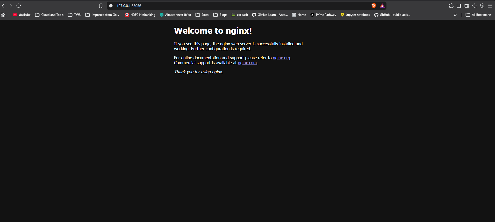

### Task 1: Deploy the Application
all the three pods are running and their IP addresses are noted down. The ClusterIP service has been created successfully, providing a stable internal IP for the pods.
web-app-fb95cd5b7-j72lc   1/1     Running   1 (11m ago)   21m   10.244.0.53   minikube   <none>           <none>
web-app-fb95cd5b7-m2ktt   1/1     Running   1 (11m ago)   21m   10.244.0.52   minikube   <none>           <none>
web-app-fb95cd5b7-tp2q9   1/1     Running   1 (11m ago)   21m   10.244.0.55   minikube   <none>           <none>

### Task 2: ClusterIP Service (Internal Access)
service responded with the stable internal IP address, allowing access to the pods within the cluster. The ClusterIP service is functioning as expected, providing a consistent endpoint for the application pods.

### Task 3: Discover Services with DNS
/ # nslookup web-app-clusterip
Server:         10.96.0.10
Address:        10.96.0.10:53
 it matches the ClusterIP service name, confirming that DNS resolution is working correctly within the cluster. The service can be accessed using its DNS name, which resolves to the stable internal IP address of the ClusterIP service.

### Task 4: NodePort Service (External Access via Node)
yes the nginx application is accessible externally via the NodePort service. The service has been created successfully, allowing access to the application pods from outside the cluster using the node's IP address and the assigned NodePort.

### Task 5: LoadBalancer Service (Cloud External Access)
the external ip is pending, indicating that the LoadBalancer service is waiting for an external IP to be assigned. This is expected behavior in a local Minikube environment, as LoadBalancer services typically require a cloud provider to provision an external IP address. however, in a cloud environment, the LoadBalancer service would receive an external IP address, allowing access to the application from outside the cluster.

### Task 6: Understand the Service Types Side by Side
the loadbalancer service is pending an external IP, while the nodeport service is accessible via the node's IP and assigned NodePort. The clusterip service is only accessible within the cluster. Each service type serves different use cases, with ClusterIP for internal communication, NodePort for external access during development, and LoadBalancer for production traffic in cloud environments. The loadbalancer service shows a nodeport as unset and endpoints for the application pods, indicating that it is correctly routing traffic to the pods. The external traffic policy is set to Cluster, meaning that traffic will be distributed across all nodes in the cluster.

$ kubectl describe service web-app-loadbalancer
Name:                     web-app-loadbalancer
Namespace:                default
Labels:                   <none>
Annotations:              <none>
Selector:                 app=web-app
Type:                     LoadBalancer
IP Family Policy:         SingleStack
IP Families:              IPv4
IP:                       10.104.7.39
IPs:                      10.104.7.39
LoadBalancer Ingress:     127.0.0.1 (VIP)
Port:                     <unset>  80/TCP
TargetPort:               80/TCP
NodePort:                 <unset>  30276/TCP
Endpoints:                10.244.0.52:80,10.244.0.53:80,10.244.0.55:80
Session Affinity:         None
External Traffic Policy:  Cluster
Internal Traffic Policy:  Cluster
Events:                   <none>
