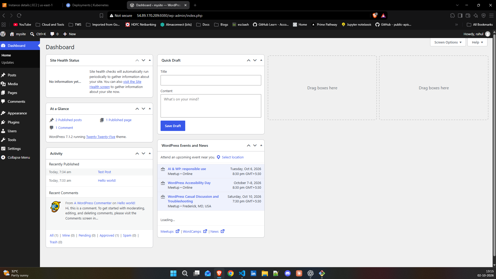
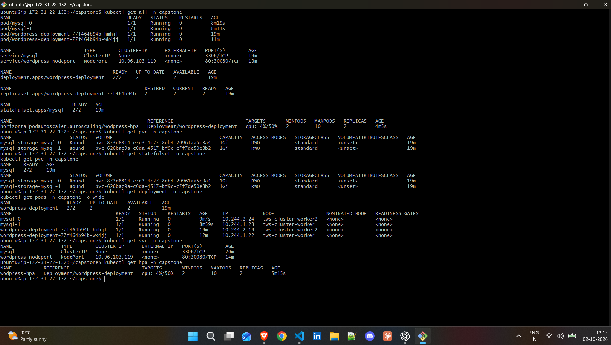
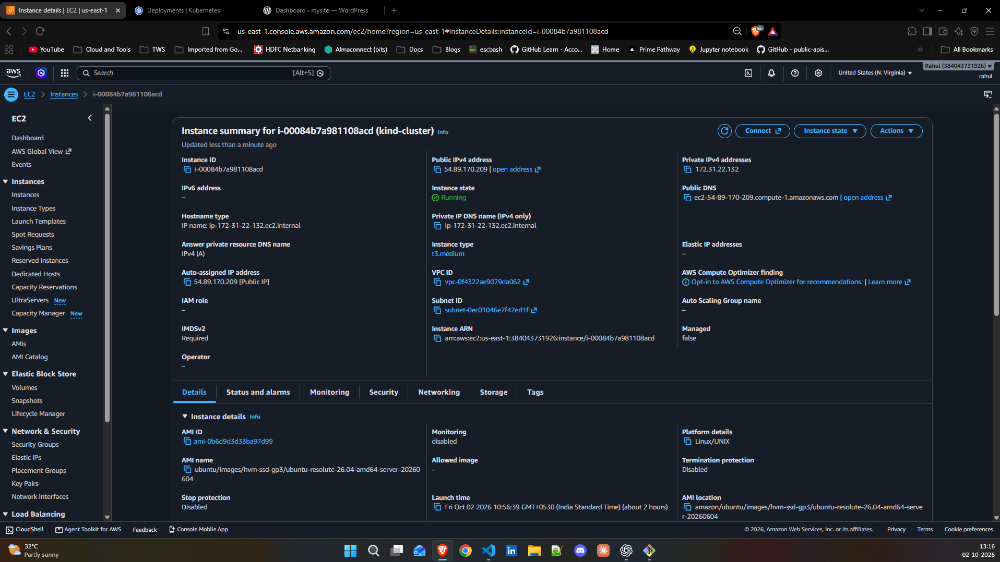

# Day 60 -- Kubernetes Capstone: WordPress + MySQL

## Overview

For Day 60 of my 90 Days of DevOps journey, I completed a Kubernetes
capstone by deploying a complete **WordPress + MySQL application** on a
Kubernetes cluster.

The goal was to combine the major Kubernetes concepts covered during the
previous days into one working application:

-   Namespace
-   Secret
-   ConfigMap
-   StatefulSet
-   PersistentVolumeClaim
-   Headless Service
-   Deployment
-   NodePort Service
-   Resource requests and limits
-   Liveness and readiness probes
-   Metrics Server
-   Horizontal Pod Autoscaler (HPA)

The final application was running successfully, with MySQL providing
persistent storage and WordPress running with two replicas.

------------------------------------------------------------------------

## Architecture

``` text
                         User / Browser
                               |
                               v
                    WordPress NodePort
                         Port 30080
                               |
                               v
                 +-------------------------+
                 | WordPress Deployment    |
                 |      2 replicas         |
                 |                         |
                 |  wordpress-pod-1        |
                 |  wordpress-pod-2        |
                 +-----------+-------------+
                             |
                             | MySQL DNS
                             v
                 +-------------------------+
                 | MySQL Headless Service  |
                 |     ClusterIP: None     |
                 +-----------+-------------+
                             |
                             v
                 +-------------------------+
                 | MySQL StatefulSet       |
                 |                         |
                 | mysql-0                 |
                 | mysql-1                 |
                 +-----------+-------------+
                             |
                             v
                 +-------------------------+
                 | PersistentVolumeClaims  |
                 |        1 Gi each        |
                 +-------------------------+

        ConfigMap -----------------> WordPress DB host/name
        Secret --------------------> MySQL + WordPress credentials
        Metrics Server ------------> HPA
        HPA -----------------------> WordPress replicas (2–10)
```

### Kubernetes namespace

All capstone resources were deployed in:

``` text
capstone
```

------------------------------------------------------------------------

# Task 1 -- Namespace

Created the dedicated namespace:

``` bash
kubectl create namespace capstone
```

The Kubernetes context was configured to work with the `capstone`
namespace.

------------------------------------------------------------------------

# Task 2 -- MySQL

## Secret

Created a Kubernetes Secret containing:

-   `MYSQL_ROOT_PASSWORD`
-   `MYSQL_DATABASE`
-   `MYSQL_USER`
-   `MYSQL_PASSWORD`

The Secret used `stringData`, so credentials did not need to be manually
Base64 encoded in the manifest.

> **Security note:** Secret values were intentionally not included in
> this documentation.

## Headless Service

Created a headless Service for MySQL:

``` yaml
clusterIP: None
```

The final Service was:

``` text
mysql
```

with MySQL exposed internally on:

``` text
3306/TCP
```

The headless Service enabled stable StatefulSet DNS names such as:

``` text
mysql-0.mysql.capstone.svc.cluster.local
```

## StatefulSet

MySQL was deployed as a StatefulSet using:

``` text
Image: mysql:8.0
Replicas: 2
```

The StatefulSet used:

-   `envFrom` with the MySQL Secret
-   CPU request: `250m`
-   Memory request: `512Mi`
-   CPU limit: `500m`
-   Memory limit: `1Gi`
-   Persistent storage mounted at:

``` text
/var/lib/mysql
```

## Persistent Storage

A `volumeClaimTemplates` section was used to automatically create
persistent storage for the StatefulSet.

Final PVCs were:

``` text
mysql-storage-mysql-0   Bound   1Gi   RWO
mysql-storage-mysql-1   Bound   1Gi   RWO
```

This means each MySQL StatefulSet pod received its own persistent volume
claim.

------------------------------------------------------------------------

# Task 3 -- WordPress

## ConfigMap

Created a ConfigMap containing the WordPress database configuration.

The database host followed the StatefulSet DNS pattern:

``` text
mysql-0.mysql.capstone.svc.cluster.local:3306
```

The WordPress database name was supplied through the ConfigMap.

## Deployment

WordPress was deployed using:

``` text
Image: wordpress:latest
Replicas: 2
```

The Deployment used:

### ConfigMap

``` yaml
envFrom:
  - configMapRef:
      name: wordpress-config
```

### Secret references

The database username and password were injected using `secretKeyRef`.

This kept credentials separate from the Deployment manifest.

## Resource Management

The WordPress containers were configured with CPU and memory
requests/limits.

This was important not only for resource control, but also because the
HPA uses CPU utilization relative to the configured CPU request.

## Health Probes

Both probes targeted:

``` text
/wp-login.php
```

on port:

``` text
80
```

The readiness probe ensured traffic was sent only when WordPress was
ready.

The liveness probe allowed Kubernetes to restart a WordPress container
when the application became unhealthy.

------------------------------------------------------------------------

# Task 4 -- Expose WordPress

A NodePort Service was created for WordPress.

Final Service configuration:

``` text
Service type: NodePort
Target port: 80
NodePort: 30080
```

The Service selected the WordPress pods using their application label.

The WordPress application was successfully accessed through the browser
and the WordPress dashboard was reachable.

------------------------------------------------------------------------

# Task 5 -- Self-Healing and Persistence

## Self-Healing

The WordPress workload was managed by a Deployment with two replicas.

If a WordPress pod is deleted, the Deployment controller recreates it
automatically to maintain the desired replica count.

Similarly, the MySQL StatefulSet maintains its MySQL pods.

## Persistence

MySQL used persistent volume claims generated through
`volumeClaimTemplates`.

This means the lifecycle of a MySQL pod is separated from the lifecycle
of its persistent storage.

The final cluster showed both MySQL PVCs in the `Bound` state.

This demonstrates the key Kubernetes principle:

> Pods are replaceable, while persistent application data should live on
> persistent storage.

------------------------------------------------------------------------

# Task 6 -- Horizontal Pod Autoscaler

Created an HPA targeting:

``` text
Deployment/wordpress-deployment
```

Configuration:

  Setting              Value
  ------------------ -------
  Minimum replicas         2
  Maximum replicas        10
  CPU target             50%

Final HPA output showed:

``` text
wordpress-hpa
Deployment/wordpress-deployment
CPU: 4% / 50%
Min: 2
Max: 10
Replicas: 2
```

Metrics Server was used to provide CPU utilization data to the HPA.

This completed the autoscaling portion of the capstone.

------------------------------------------------------------------------

# Final Cluster Verification

The final `kubectl get all -n capstone` output showed:

``` text
MySQL:
mysql-0     1/1 Running
mysql-1     1/1 Running

WordPress:
wordpress-deployment-...     1/1 Running
wordpress-deployment-...     1/1 Running

Deployment:
wordpress-deployment         2/2 Ready

StatefulSet:
mysql                         2/2 Ready

Services:
mysql                         ClusterIP / Headless
wordpress-nodeport            NodePort 80:30080

HPA:
wordpress-hpa                 CPU 4%/50%
                              Min 2
                              Max 10
                              Replicas 2
```

This provided the final proof that the application stack was running
successfully.

------------------------------------------------------------------------

# Verification Commands

Useful commands used during the capstone:

``` bash
kubectl get all -n capstone
```

``` bash
kubectl get pvc -n capstone
```

``` bash
kubectl get statefulset -n capstone
```

``` bash
kubectl get deployment -n capstone
```

``` bash
kubectl get svc -n capstone
```

``` bash
kubectl get hpa -n capstone
```

``` bash
kubectl top pods -n capstone
```

``` bash
kubectl get pods -n capstone -o wide
```

------------------------------------------------------------------------

# Troubleshooting Lessons

This capstone involved several realistic Kubernetes troubleshooting
scenarios.

## 1. StatefulSet API version

Initially, `StatefulSet` was incorrectly configured with:

``` yaml
apiVersion: v1
```

The correct API version is:

``` yaml
apiVersion: apps/v1
```

## 2. StatefulSet DNS naming

The StatefulSet and headless Service names must align with the DNS name
expected by the application.

The final configuration used:

``` text
mysql-0.mysql.capstone.svc.cluster.local
```

## 3. ConfigMap reference

WordPress initially failed with:

``` text
configmap "wordpress-config" not found
```

The ConfigMap was created in the correct `capstone` namespace and the
Deployment was restarted.

## 4. WordPress HTTP 500

WordPress initially returned HTTP 500 from:

``` text
/wp-login.php
```

The troubleshooting process verified:

-   WordPress environment variables
-   MySQL DNS resolution
-   TCP connectivity to MySQL port 3306
-   MySQL Service configuration

This helped isolate application configuration from Kubernetes networking
problems.

## 5. HPA CPU metrics

The HPA initially displayed:

``` text
cpu: <unknown>/50%
```

Metrics Server was checked and CPU metrics were verified using:

``` bash
kubectl top nodes
kubectl top pods -n capstone
```

Once metrics became available, the HPA reported actual CPU utilization.

------------------------------------------------------------------------

# Concepts Mapped to Learning Days

  Kubernetes Concept            Learning Day Used in Capstone
  --------------------------- -------------- --------------------
  Namespace                           Day 52 Yes
  Deployment                          Day 52 Yes
  Services                            Day 53 Yes
  NodePort                            Day 53 Yes
  ConfigMap                           Day 54 Yes
  Secret                              Day 54 Yes
  StatefulSet                         Day 56 Yes
  PersistentVolumeClaim               Day 56 Yes
  Headless Service                    Day 56 Yes
  Resource Requests/Limits            Day 57 Yes
  Liveness/Readiness Probes           Day 57 Yes
  Metrics Server                      Day 58 Yes
  HPA                                 Day 58 Yes
  Helm                                Day 59 Covered separately

------------------------------------------------------------------------

# What I Learned

The biggest takeaway from this capstone was that Kubernetes resources
are not isolated concepts.

A real application requires multiple resources to work together:

-   Secrets provide credentials.
-   ConfigMaps provide application configuration.
-   StatefulSets provide stable identities for stateful workloads.
-   PVCs provide persistent storage.
-   Services provide networking and service discovery.
-   Deployments maintain application replicas.
-   Probes determine application health.
-   Resource requests/limits provide predictable resource management.
-   Metrics Server provides resource metrics.
-   HPA uses those metrics to automatically adjust replicas.

The troubleshooting was also an important part of the learning. Small
naming differences between a StatefulSet, Service, ConfigMap, and
application configuration can prevent an otherwise healthy application
from working.

------------------------------------------------------------------------

# What I Would Add for Production

For a production-ready implementation, I would consider adding:

-   TLS/HTTPS through an Ingress controller
-   A proper Ingress or LoadBalancer instead of NodePort
-   External secret management such as AWS Secrets Manager
-   MySQL replication or a managed database such as Amazon RDS
-   NetworkPolicies
-   PodDisruptionBudgets
-   Separate namespaces/environments
-   Centralized logging
-   Prometheus and Grafana monitoring
-   Alerting
-   Resource quotas and LimitRanges
-   Backup and restore automation
-   Container image scanning
-   CI/CD deployment pipeline
-   Helm or GitOps-based application management

------------------------------------------------------------------------

# Final Result

The Day 60 Kubernetes capstone successfully brought together the major
Kubernetes concepts learned throughout the previous ten days into one
working WordPress + MySQL application.

### Final stack

``` text
Kubernetes
├── Namespace: capstone
├── Secret
├── ConfigMap
├── MySQL StatefulSet
│   ├── mysql-0
│   ├── mysql-1
│   └── 2 × 1Gi PVC
├── MySQL Headless Service
├── WordPress Deployment
│   └── 2 replicas
├── WordPress NodePort Service
│   └── 30080
├── Resource Requests/Limits
├── Liveness/Readiness Probes
├── Metrics Server
└── HPA
    ├── Min: 2
    ├── Max: 10
    └── CPU target: 50%
```

## Conclusion

**Day 60 complete.**

This capstone was a practical demonstration of how Kubernetes resources
combine to deploy, expose, monitor, heal, persist, and autoscale a real
application.

> From individual YAML resources to a complete application platform ---
> this capstone connected the concepts learned throughout the Kubernetes
> journey.

------------------------------------------------------------------------

## Evidence

The accompanying screenshots document:

1.  Running WordPress application/dashboard
2.  `kubectl get all -n capstone`
3.  StatefulSet and PVC status
4.  WordPress Deployment and Service
5.  HPA showing CPU target, minimum replicas, maximum replicas, and
    current replicas
6.  AWS EC2 instance hosting the Kubernetes environment

  